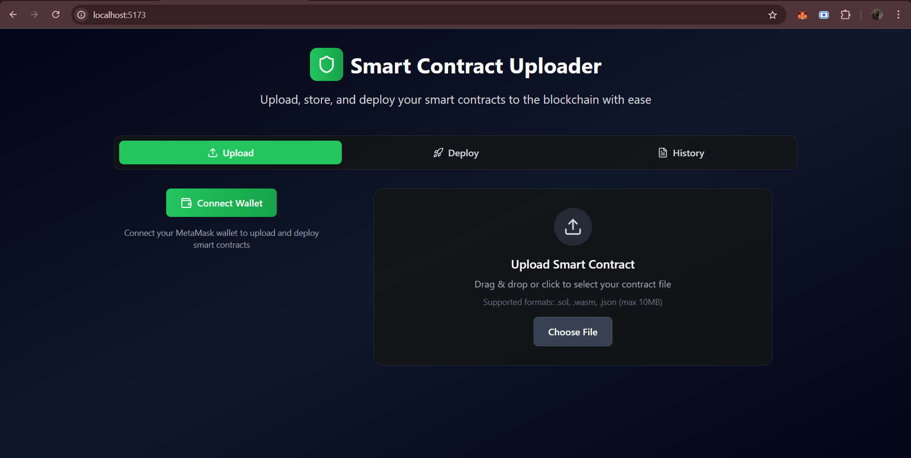
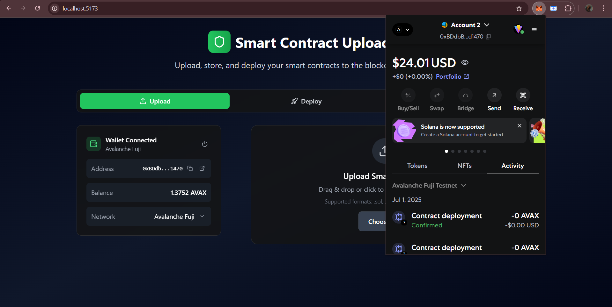
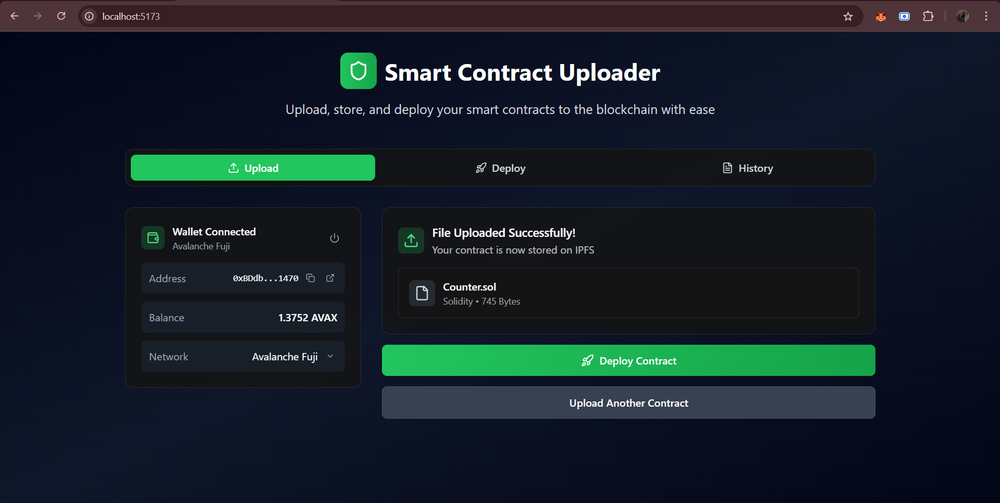
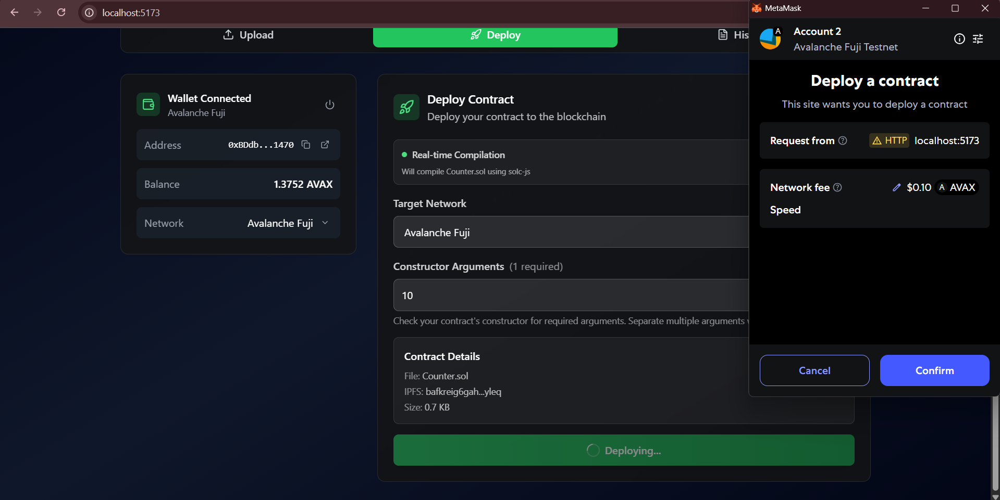
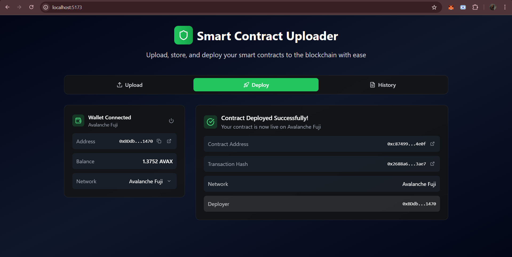
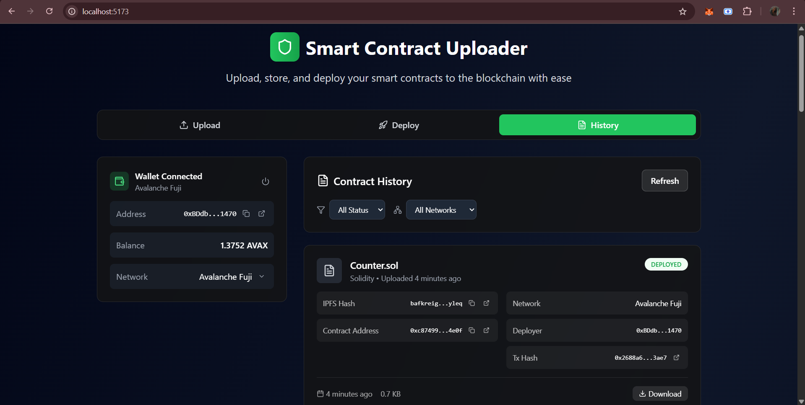

# Smart Contract Uploader

A minimalist React web application for uploading, storing, and deploying Solidity smart contracts to Ethereum-compatible testnets with IPFS integration.



## Features

- **File Upload**: Upload Solidity (.sol) smart contract files via drag-and-drop interface
- **IPFS Storage**: Store contract files on IPFS using Pinata service for decentralized access
- **Multi-Network Deployment**: Deploy contracts to Avalanche Fuji, Sepolia, and Polygon networks
- **MetaMask Integration**: Connect wallet and manage transactions through MetaMask
- **Contract Management**: Track deployment history with Firebase Firestore
- **Gas Optimization**: Automatic gas estimation and network-specific optimization

## Tech Stack

- **Frontend**: React 18, Vite, Tailwind CSS
- **Backend**: Node.js, Express, solc-js (Solidity compiler)
- **Blockchain**: ethers.js, MetaMask integration
- **Storage**: IPFS (Pinata), Firebase Firestore
- **Deployment**: Supports Avalanche Fuji, Sepolia, Polygon testnets

## Quick Start

1. **Clone and Install**
   ```bash
   git clone <repository-url>
   cd smart-contract-uploader
   npm install
   cd backend && npm install && cd ..
   ```

2. **Environment Setup**
   Copy `.env.example` to `.env` and configure:
   ```
   # Firebase (required)
   VITE_FIREBASE_API_KEY=your_firebase_api_key
   VITE_FIREBASE_PROJECT_ID=your_project_id
   
   # IPFS Pinata (required for real uploads)
   VITE_PINATA_API_KEY=your_pinata_api_key
   VITE_PINATA_SECRET_KEY=your_pinata_secret_key
   
   # Backend URL (default: http://localhost:3001)
   VITE_BACKEND_URL=http://localhost:3001
   ```

3. **Run Application**
   ```bash
   # Option 1: Run both frontend and backend together
   npm run dev:full
   
   # Option 2: Run separately
   npm run backend    # Terminal 1 - Backend server
   npm run dev        # Terminal 2 - Frontend server
   ```

4. **Setup MetaMask**
   - Install MetaMask browser extension
   - Add Avalanche Fuji testnet (recommended)
   - Get test AVAX from [Avalanche Faucet](https://core.app/tools/testnet-faucet/)

## Usage

### 1. Connect Wallet

Click "Connect Wallet" and connect your MetaMask to get started.

### 2. Upload Contract

Drag and drop your .sol file or click to browse. The app will automatically compile it and detect constructor requirements.

### 3. Deploy Contract

Select target network, provide constructor arguments if needed, and deploy your contract.

### 4. Deployment Success

View your successfully deployed contract with links to blockchain explorers.

### 5. Track Deployments

Monitor all your contract deployments in the history dashboard with filtering options.

## Smart Contract Compilation

This application now features **real-time Solidity compilation** using a Node.js backend with `solc-js`:

- **Primary**: Real Solidity compilation via Node.js backend using `solc-js` library
- **Fallback 1**: Pre-compiled contract templates for common patterns

**Backend Integration:**
The Express.js backend provides a `/compile` endpoint that accepts Solidity source code and returns compiled bytecode and ABI using the official Solidity compiler. This enables deployment of any valid Solidity contract, not just pre-compiled templates.

## Supported Networks

- **Avalanche Fuji** - Avalanche testnet
- **Sepolia** - Ethereum testnet  
- **Polygon Mainnet** - Production Polygon network

## License

MIT License
